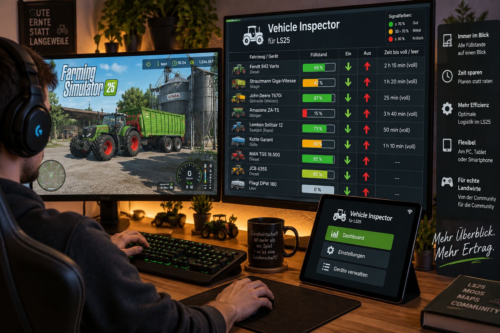
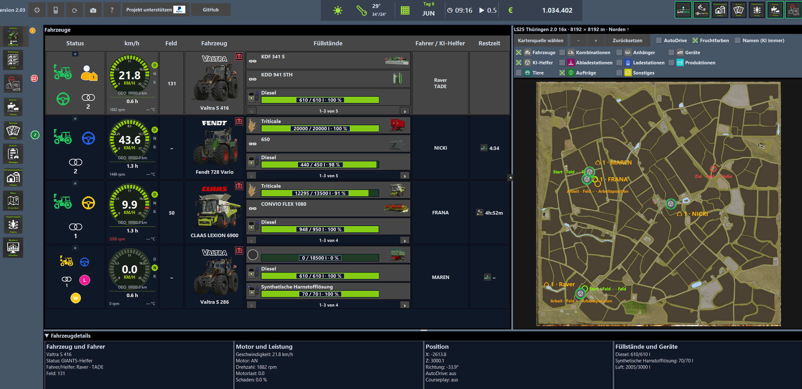
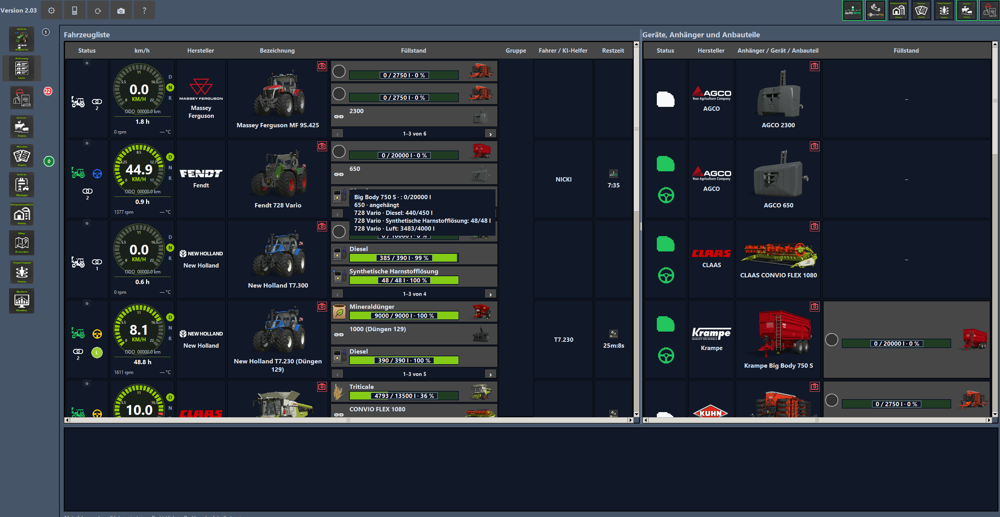
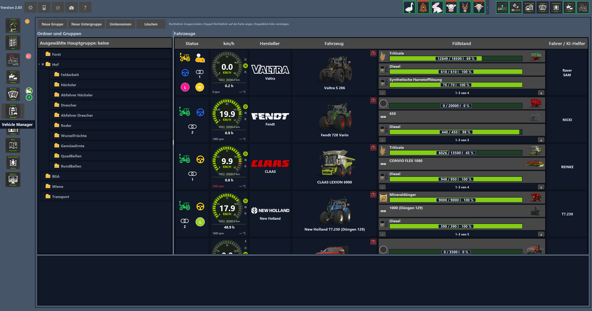
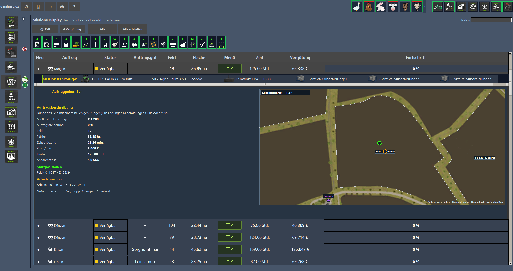
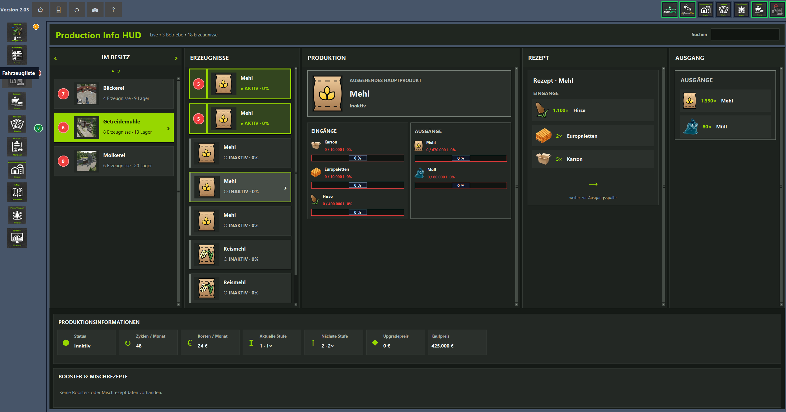
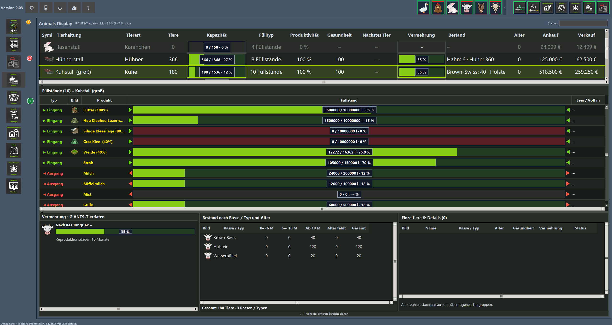
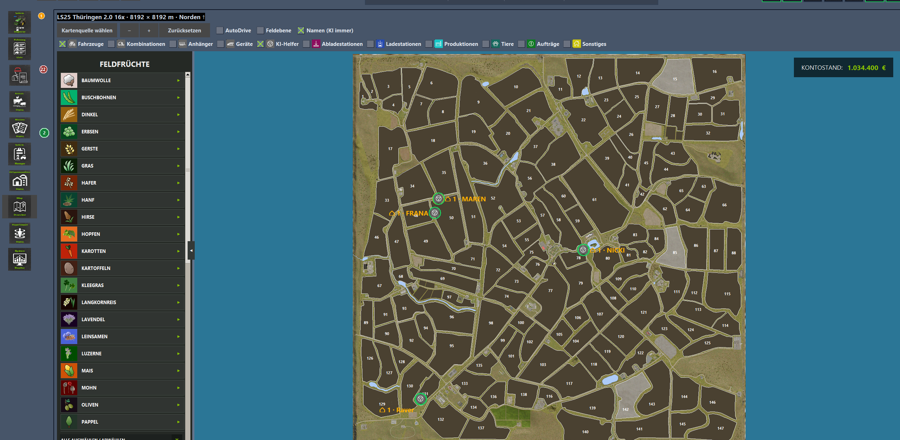
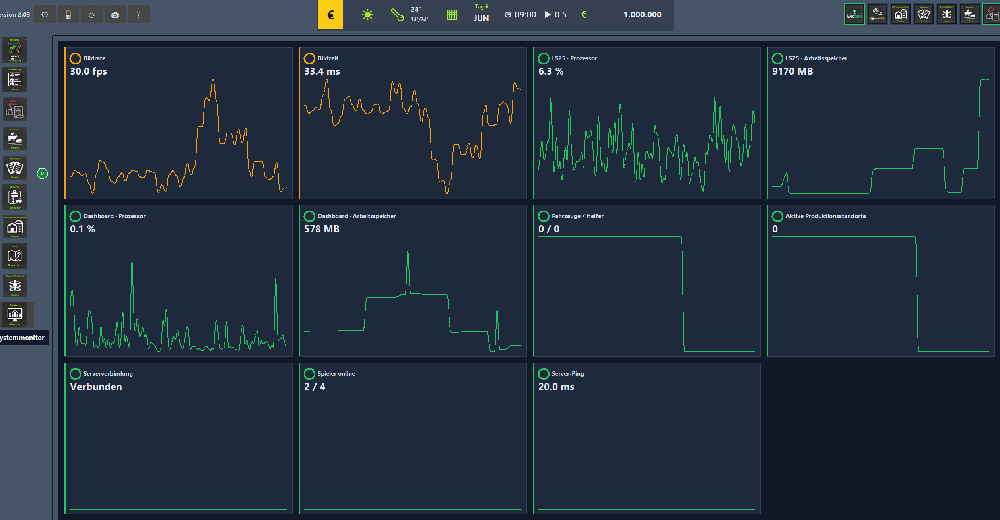
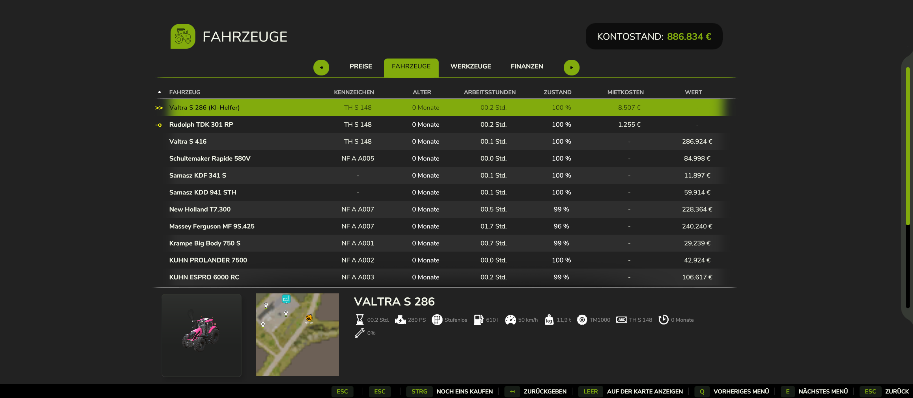

# LS25 Dashboard

*Illustratives Projektmotiv. Aktuelle Ansichten der Anwendung findest du unten und in der Bildergalerie.*

**Live-Übersicht für Farming Simulator 25 – Desktop, Browser und Tablet**

### 5. Oktober 2026 – Dashboard 2.03.20261005.1

Die neue Public-Testversion ist nach eigener Sichtprüfung freigegeben: frei benannte Spielprofile, dauerhaft gespeicherte manuelle Pfade, automatische Pfadanzeige direkt im Feld und echte farbige Einzelprüfungen. Dazu kommen der automatisch abgeleitete Fotoordner, ein per Maus vergrößerbarer Prüfbericht, Scrollbedienung und die vollständige Buildnummer. Der Begleitmod bleibt unverändert bei **2.0.3.40**.

[Neue Pfadhilfe](docs/PFADE.md) · [Zusammengefasste Änderungen und Prüfgrenzen](docs/RELEASE_NOTES.md)

**Paket:** `LS25_Dashboard_2.03.20261005.1_UNZIP_ME.zip` – äußere ZIP entpacken, Setup starten und die enthaltene Mod-ZIP geschlossen lassen. Installer und unveränderter Begleitmod 2.0.3.40 sind gemeinsam enthalten.

**[Aktuelle Public-Testversion 2.03.20261005.1 herunterladen – UNZIP_ME.zip (ShareMods)](https://sharemods.com/wlci6tbss7vr/LS25_Dashboard_2.03.20261005.1_UNZIP_ME.zip.html)**

Die folgenden Downloads sind ältere Versionen und bleiben zur Nachvollziehbarkeit verfügbar.

### Ältere Downloads

**Öffentliche Testversion:** Dashboard und Begleitmod sind als Windows-Paket über ShareMods verfügbar. Die Funktionen befinden sich weiterhin im Test; bekannte Grenzen stehen in der Installationsanleitung.

**[Bisherige Windows-Testversion herunterladen (älterer Stand)](https://sharemods.com/hsk5c6xu3an5/LS25_Dashboard_2.03_Windows_Public.zip.html)**

**Update verfügbar:** Browser-/Tablet-Erweiterungen, automatische Datenabfrage und Setup mit Update/Deinstallation sind im neuen Paket enthalten. Der bisherige Download oben bleibt als älterer Stand verfügbar. [Alle Änderungen](docs/RELEASE_NOTES.md).

**[So sieht die Browser- und Tabletansicht aus – neue Bildergalerie](docs/BROWSER_TABLET.md)**

### Älteres Update mit Mod 2.0.3.38

**[Update herunterladen – Setup + Mod 2.0.3.38 + Anleitung (ShareMods)](https://sharemods.com/fmr8z38ao75v/LS25_Dashboard_2.03_Mod_2.0.3.38_Windows_Public_ENTPACKEN.zip.html)**

Neues Windows-Paket mit Begleitmod **2.0.3.38**. Das Paket eignet sich auch für eine Erstinstallation. Bei einem Update denselben Dashboard-Ordner wählen; Einstellungen und eigene Bilder bleiben erhalten.

### Mods für die zugehörigen Anzeigen und Funktionen

**Für den vollen Funktionsumfang:** Installiere und aktiviere den mitgelieferten Begleitmod sowie die unten aufgeführten Zusatzmods, damit du alle bisher eingebauten Anzeigen, HUDs und Mod-Anbindungen nutzen kannst. Ohne einen Zusatzmod stehen dessen zugehörige Funktionen nicht vollständig zur Verfügung.

**Die Modnamen sind anklickbar:** Öffne die jeweilige Originalseite und lade dort die LS25-Version herunter. Der benötigte Begleitmod **FS25_LS25DashboardMod.zip** ist bereits im Windows-Paket enthalten. Die folgenden Zusatzmods werden separat heruntergeladen; du brauchst sie für die jeweils zugehörigen Erweiterungen.

| Anzeige | Benötigter Mod / Originalseite |
|---|---|
| Fahrzeuge und Fahrzeugliste | [Vehicle Inspector](https://www.farming-simulator.com/mod.php?lang=de&country=de&mod_id=311140&title=fs2025) |
| AutoDrive-HUD | [AutoDrive](https://github.com/Stephan-S/FS25_AutoDrive) |
| Courseplay-HUD | [Courseplay](https://www.farming-simulator.com/mod.php?lang=de&country=de&mod_id=331515&title=fs2025) |
| Vehicle Manager | [Vehicle Manager](https://www.farming-simulator.com/mod.php?lang=de&country=de&mod_id=311112&title=fs2025) |
| Mission Display und Missions-HUD | [Missions Display](https://www.farming-simulator.com/mod.php?lang=de&country=de&mod_id=309928&title=fs2025) |
| Player Position und Teleport-HUD | [Player Teleport Display](https://www.farming-simulator.com/mod.php?lang=de&country=de&mod_id=327619&title=fs2025) |
| Preis-/Bestandsreiter und HUD | [FillType Amount Price Display](https://www.farming-simulator.com/mod.php?lang=de&country=de&mod_id=309964&title=fs2025) |
| Produktionsreiter und HUD | [Production Info HUD](https://www.farming-simulator.com/mod.php?lang=de&country=de&mod_id=313960&title=fs2025) |
| Tierreiter und HUD | [Animals Display](https://www.farming-simulator.com/mod.php?lang=de&country=de&mod_id=334131&title=fs2025) |
| Map Overview / AllRound-Anzeige | [AllRound Extension](https://www.farming-simulator.com/mod.php?lang=de&country=de&mod_id=310611&title=fs2025) |

**Einrichten:** Spiel speichern und beenden. Die heruntergeladenen Mod-ZIPs **nicht entpacken**, sondern in deinen verwendeten LS25-Mods-Ordner kopieren. Beim nächsten Laden des Spielstands aktivieren; im Mehrspieler dieselben Modversionen auf Server und Clients verwenden.

Die neuen grauen Icons mit Hinweisen und Doppelklick-Links sind im Update mit Begleitmod 2.0.3.38 enthalten. [Details zu fehlenden Mods](docs/FEHLENDE_MODS.md).

Enthalten: Dashboard-Setup mit Ordnerauswahl und optionalem Desktop-Symbol, Begleitmod als ZIP und Installationsanleitung. Python ist enthalten. Gesamtpaket entpacken; Mod-ZIP geschlossen lassen.

**[Installation: Setup, Begleitmod und erster Start](docs/INSTALLATION.md)**

**[FAQ: Installation, Fotomodus, Helfer, Aufträge und Fehlerhilfe](docs/FAQ.md)**

[Versionshinweise und bekannte Einschränkungen](docs/RELEASE_NOTES.md)

## Was ist das LS25-Dashboard?

Das **LS25-Dashboard ist deine zusätzliche Übersicht für den Landwirtschafts-Simulator 25**. Du kannst es neben dem Spiel auf einem zweiten Bildschirm oder im Browser auf einem Tablet nutzen. So behältst du deinen Hof im Blick, während du beispielsweise mit dem Traktor auf dem Feld arbeitest.

Die Anleitung beschreibt folgende Funktionen:

- **Fahrzeuge und Helfer:** Du siehst Fahrzeuge, angehängte Geräte, Geschwindigkeit, Füllstände und den Status von GIANTS-Helfern, AutoDrive und Courseplay. Farben helfen beim Erkennen: Grün bedeutet normaler Betrieb, Gelb beispielsweise Warten, Rot ein gemeldetes Problem.
- **Fuhrpark verwalten:** In der Fahrzeugliste findest du deine Maschinen. Im Vehicle Manager kannst du sie in eigene Gruppen und Untergruppen einteilen, etwa „Ernte“, „Transport“ oder „Hofarbeit“.
- **Aufträge überblicken:** Die Missionsanzeige zeigt verfügbare, aktive und erledigte Aufträge mit Feld, Fortschritt, Vergütung und weiteren Details. Aufgeklappt siehst du auch die vorgesehenen Mietfahrzeuge.
- **Produktionen überwachen:** Du erkennst, welche Rohstoffe vorhanden sind, welche Produkte entstehen und wo Nachschub nötig wird. Wenn passende Daten vorliegen, wird auch die verbleibende Laufzeit angezeigt.
- **Tiere versorgen:** Die Tierübersicht zeigt unter anderem Anzahl, Gesundheit, Produktivität sowie Futter- und Produktbestände.
- **Karte und Preise ansehen:** Auf der Karte findest du Fahrzeuge, Felder und Betriebe. Filter blenden einzelne Bereiche ein oder aus. Die Preisübersicht zeigt mit der passenden Erweiterung Bestände, Marktpreise und Preisbewegungen.
- **Leistung prüfen:** Der Systemmonitor zeigt verfügbare Werte zu Bildrate, Prozessor und Arbeitsspeicher.

### Wie funktioniert die Verbindung zum Spiel?

Ein Begleitmod namens `FS25_LS25DashboardMod` sammelt die Informationen im laufenden Spiel. Das Dashboard liest diese Daten und aktualisiert seine Anzeigen automatisch. Unterstützte Bedienaktionen werden wieder an das Spiel übergeben. Für aktuelle Werte müssen also der Begleitmod aktiviert und ein Spielstand geladen sein.

Zusätzliche Mods erweitern die Möglichkeiten. AutoDrive und Courseplay liefern beispielsweise ihre eigenen Helferinformationen. Für den Preis- und Bestandsreiter wird **FillTypeAmountPrice Display** benötigt. Die grundlegenden Fahrzeug-, Missions-, Produktions- und Tierdaten brauchen nicht alle diese Zusatzmods.

### So benutzt du es im Alltag

1. **Dashboard starten**, dann LS25 mit aktiviertem Begleitmod und deinem Spielstand öffnen.
2. **Links einen Bereich auswählen**, zum Beispiel Fahrzeuge, Missionen, Tiere oder Karte.
3. **Einträge anklicken**, um sie auszuwählen oder Details aufzuklappen. Bei Fahrzeugen steigst du am PC per Doppelklick ein; ein Rechtsklick zeigt das Fahrzeug auf der Karte.
4. **Die Karte mit dem Mausrad zoomen** und durch Ziehen verschieben.
5. **Ansicht anpassen:** Schrift, Farben, Fenstergröße und verschiedene Warnschwellen lassen sich einstellen. Die Register kannst du durch Ziehen umsortieren.

Ein praktisches Beispiel: Du erntest gerade ein Feld. Auf dem zweiten Bildschirm siehst du gleichzeitig den Füllstand deiner Fahrzeuge, den Status des Abfahrers, den Fortschritt deiner Aufträge und ob einer Produktion Rohstoffe fehlen.

## Projekt unterstützen

Wenn dir das Dashboard gefällt, kannst du die Weiterentwicklung freiwillig über PayPal unterstützen.

Fragen, Feedback oder Austausch zum Dashboard? Hier geht es zur Discord-Community:

## Einblicke und bebilderte Anleitung

### Fahrzeuge und Helfer

### Fahrzeugliste und Geräte

### Vehicle Manager

### Missionen

### Produktionen

### Tiere

### Kartenübersicht

### Systemmonitor

**[Dashboard Schritt für Schritt: acht Ansichten mit Pfeilen und Erklärungen](docs/TUTORIAL.md)**

Fahrzeuge auswählen, Füllstände lesen, Gruppen bilden, Aufträge verstehen, Produktionen versorgen und Karten bedienen.

[Alle aktuellen Screenshots](docs/SCREENSHOTS.md) · [Ausführliche Bedienung](docs/BEDIENUNG.md)

Bildstand: 27. September 2026 aus dem lokalen Teststand. Dieses Repository enthält Dokumentation und Bilder; das Windows-Paket ist über den ShareMods-Link oben erhältlich.

## Eigene Shop-Icons

**[Fotoanleitung mit sieben Bildern und Pfeilen](docs/EIGENE_SHOP_ICONS.md)**: Kamera in der Fahrzeugzeile öffnen, mit Maus und Mausrad ausrichten, **Weiter** zur Kontrolle und **Final auslösen** zum Speichern. Du bleibst im ursprünglichen Fahrzeug; Abbrechen per Maus oder Escape ist im gezeigten Mehrspielertest bestätigt.

Die eigenen Vorschau-Icons erscheinen auch im Escape-Menü in Fahrzeugübersicht und Karten-Auswahl. Mit installiertem Vehicle Inspector zeigt dessen Vorschau beim Darüberfahren mit der Maus das neue Bild. Die Bilder dokumentieren den Teststand, keine allgemeine Freigabe aller Modkombinationen.

## Verfügbarkeit

Die öffentliche Windows-Testversion ist über den ShareMods-Link oben erhältlich. Dieses Repository enthält weiterhin ausschließlich Dokumentation und Bilder; das Quellrepository bleibt privat. Fragen und Rückmeldungen sind über den oben verlinkten Discord willkommen.
