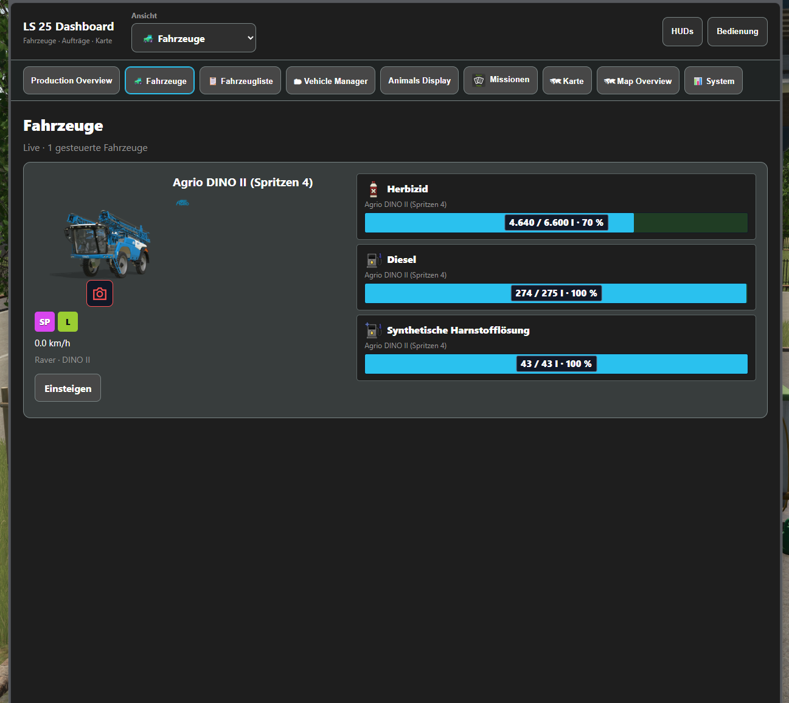
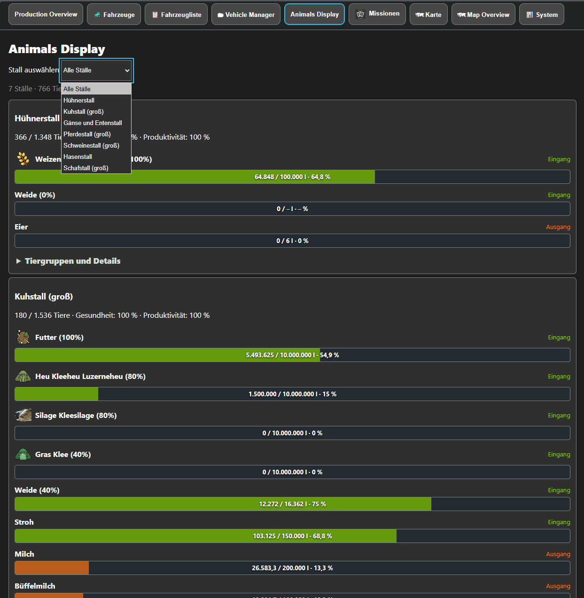
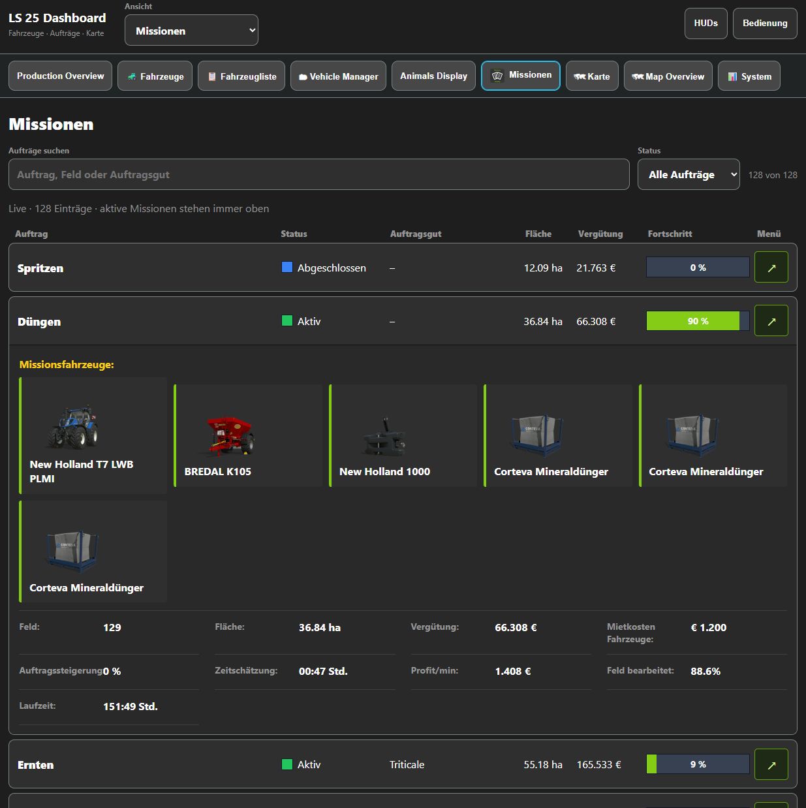

# Browser- und Tabletansicht

Echte Spielaufnahmen vom 28. September 2026. Die Ansicht passt sich der verfügbaren Fensterbreite an. Auf den früheren Aufnahmen heißt der Produktionsreiter noch „Production Overview“; im aktuellen Update lautet er **Production Info HUD**.

## Fahrzeuge und Füllstände

Fahrzeugbild, Gerätestatus und Füllstände stehen zusammen. „Einsteigen“ führt die Aktion im Spiel aus; die Kamera öffnet den Fotomodus.

## Animals Display

Alle Ställe oder einen einzelnen Stall auswählen. Produktbilder und Balken zeigen die Versorgung und Erzeugnisse. Tiergruppen und Details lassen sich aufklappen. Ein Strich bedeutet eine fehlende Kapazitätsangabe.

## Missionen

Suche und Statusfilter helfen bei vielen Aufträgen. Aufgeklappte Details zeigen die bereitgestellten Fahrzeuge und weitere Missionsangaben. Status und Fortschritt stammen aus dem Spiel; widersprüchliche Werte wie „Abgeschlossen“ bei null Prozent sind kein Beleg für einen behobenen Missionsfehler.

[Zur Bildergalerie](SCREENSHOTS.md) · [Versionshinweise](RELEASE_NOTES.md) · [Installation](INSTALLATION.md)
