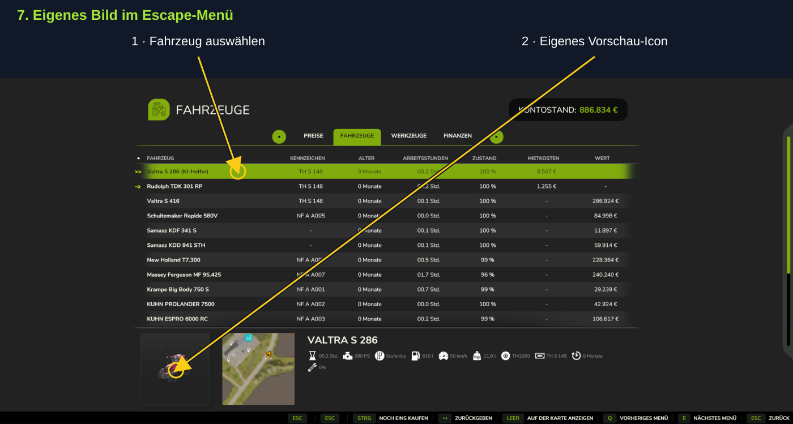
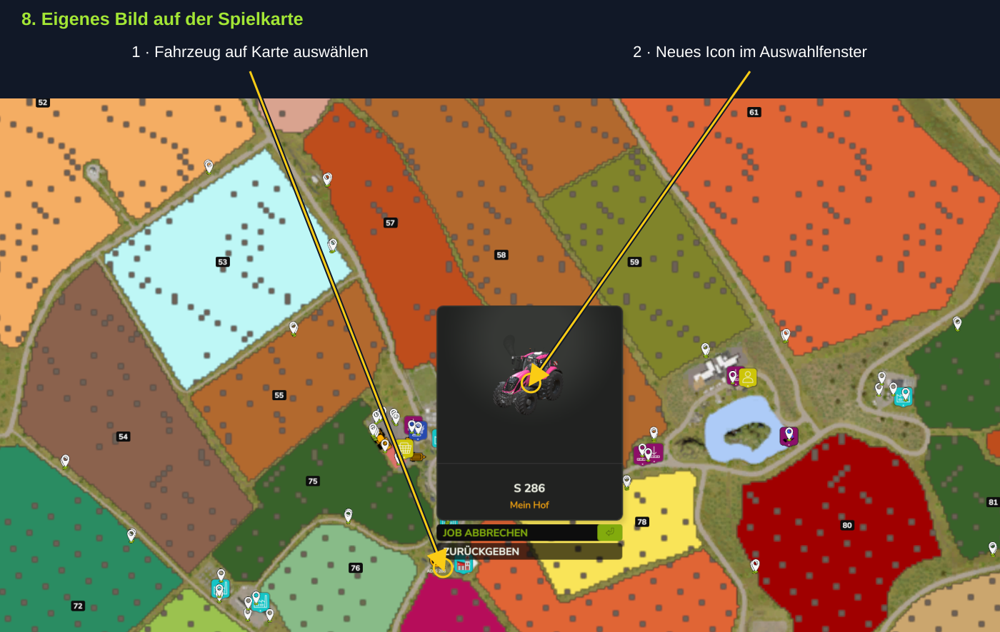

# Fahrzeugfotos – Schritt für Schritt

Bilder aus dem Mehrspielertest vom 27. September 2026. Pfeile und Hinweise liegen über unveränderten Screenshots. Das Windows-Paket ist als öffentliche Testversion erhältlich; den Download findest du auf der Projektstartseite.

## Wofür ist der Fotomodus?

Erstelle ein eigenes Vorschau-Icon deines tatsächlich konfigurierten Fahrzeugs, Anhängers oder Geräts. Das fertige Bild zeigt das einzelne Objekt auf transparentem Hintergrund. Landschaft, andere Fahrzeuge und Bildschirmtexte aus der Live-Ansicht gehören nicht zum gespeicherten Icon.

## Voraussetzungen und Teststand

Spielstand und Dashboard müssen laufen und verbunden sein. Verwende auf Server und Clients denselben Begleitmod. Das Objekt muss bereitgestellt sein und die Foto-Berechtigung besitzen. Die gezeigten Schritte wurden am 27. September 2026 mit Begleitmod 2.0.3.34 im Mehrspieler vom Nutzer bestätigt: Aufnahme, Mausausrichtung, Zoom, Rückkehr und Abbruch per Maus sowie Escape. Das ist kein vollständiger Kompatibilitätstest aller Mods oder mehrerer Clients.

> **Neuer Singleplayer-Spielstand und der Fotomodus startet nicht?** Zuerst speichern, Spiel und Dashboard normal beenden und denselben Spielstand neu laden. [Erklärung und Schritte in den FAQ](FAQ.md).

## 1. Kamera im Dashboard öffnen

Klicke auf die kleine Kamera in der Fahrzeug- oder Gerätezeile beim gewünschten Objekt. Rot bedeutet: lokal noch kein gültiges eigenes Foto. Grün bedeutet: Foto vorhanden; ein Klick erlaubt eine neue Aufnahme. Die große Kamera oben in der Werkzeugleiste macht dagegen einen Screenshot des Dashboards. Reine Vorschau- und Detailbilder dienen der Anzeige; benutze zum Fotografieren die Fahrzeugzeile.

## 2. Du bleibst in deinem Fahrzeug

Wechsle zum Spielfenster. Der Fotodialog zeigt das gewählte Objekt, ohne deine Spielfigur aussteigen oder teleportieren zu lassen. Du kannst auch ein anderes Fahrzeug fotografieren und bleibst anschließend im zuvor besetzten Fahrzeug. Ein laufender Helfer wird durch den Fotoaufruf nicht angehalten.

## 3. Ausrichten und zoomen

Halte innerhalb des grünen Rahmens die linke Maustaste gedrückt und ziehe zum Drehen und Ändern der Blickhöhe. Das Mausrad im Rahmen verändert den Abstand. Alternativ gibt es unten Links drehen, Rechts drehen, Höher, Tiefer, Näher und Weiter weg. Richte das ausgewählte Objekt so aus, dass es vollständig im Rahmen liegt. Klicke danach Weiter.

[Originalbild](images/photo_ausrichten.png)

## Ein anderer Blickwinkel

In der Live-Vorschau siehst du weiterhin die Umgebung und benachbarte Maschinen. Fotografiert wird das ausgewählte Objekt – in diesen Beispielen der rote Lkw. Durch Drehen und Zoomen wählst du die gewünschte Ansicht; die Nachbarfahrzeuge werden beim fertigen Icon nicht mit aufgenommen.

[Originalbild](images/photo_blickwinkel.png)

## 4. Weiter ist noch keine Aufnahme

Weiter öffnet nur die letzte Kontrolle. Die Fotokamera bleibt dabei stehen und die Ausrichtung ist gesperrt. Erst Final auslösen erstellt die Aufnahme. Zurück führt wieder zur Ausrichtung. Abbrechen oder Escape schließt ohne neues Foto; ein vorheriges gültiges Foto bleibt erhalten.

[Originalbild](images/photo_final.png)

## 5. Speicherung und Rückkehr

Nach Final auslösen wird das Bild geprüft und gespeichert. Lass das Dashboard dafür geöffnet. Warte auf Fahrzeugfoto gespeichert. Danach kommt die normale Kamera zurück: Warst du vorher im Valtra, bleibst du im Valtra – auch nach dem Foto eines anderen Fahrzeugs. Die sichtbare Umlautstörung der älteren Erfolgsmeldung im Screenshot ist im nächsten Update korrigiert; der Screenshot bleibt unverändert.

[Originalbild](images/photo_gespeichert.png)

## 6. Vorschau mit Vehicle Inspector

Wenn Vehicle Inspector installiert ist, erscheint das neue Vorschau-Icon beim Darüberfahren mit der Maus über das jeweilige Fahrzeug in seiner Anzeige. Die Bilder zeigen den pinken Valtra und darunter dessen Anbaugerät. Der Nutzer hat diese Integration im gezeigten Spielstand getestet. Andere Mods mit eigenem Bildspeicher können zusätzliche Unterstützung benötigen.

[Originalbild](images/photo_vehicle_inspector.png)

## 7. Eigenes Bild im Escape-Menü

Öffne im Spiel mit Escape das Menü und wähle die Fahrzeugübersicht. Beim ausgewählten Fahrzeug erscheint unten das eigene Vorschaubild. Im Screenshot ist der pinke Valtra S 286 ausgewählt. Es handelt sich um die Fahrzeugansicht des Spiels, nicht um das Dashboard.

[Originalbild](images/photo_escape_fahrzeuge.png)

## 8. Eigenes Bild auf der Spielkarte

Auch bei der Auswahl eines Fahrzeugs auf der Karte im Escape-Menü erscheint das neue Icon im Auswahlfenster. Hier zeigt das Fenster den pinken S 286 und seinen Hof. Die darunterliegenden Spielaktionen gehören zum normalen Kartenmenü; für das Foto musst du keinen Auftrag abbrechen und kein Fahrzeug zurückgeben.

[Originalbild](images/photo_escape_karte.png)

## Fotos ersetzen und Spielstände trennen

Über die grüne Kamera kannst du ein vorhandenes Foto ersetzen. Erst eine erfolgreich geprüfte Aufnahme ersetzt das bisherige Icon. Bilder liegen lokal in den Mod-Einstellungen und werden über die Spielstandkennung sowie Einzelspieler/Mehrspieler und Karte getrennt zugeordnet. Im Mehrspieler werden kleine Fotozuordnungen und Kameraangaben ausgetauscht; die Bilddateien werden lokal erzeugt. Ein Test mit mehreren echten Clients bleibt offen.

## Wenn es nicht klappt

Bei Daten veraltet auf frische Spieldaten warten. Bei Spiel beschäftigt das offene Spielmenü schließen. Bei fehlendem Gerät prüfen, ob es bereits bereitgestellt wurde und die Rechte stimmen. Bei einer fehlgeschlagenen Prüfung bleibt das bisherige gültige Foto oder das Standardbild erhalten. Fehler mit Zeitpunkt und Log melden; ein kurzer Ruckler beim finalen Rendern beweist für sich keinen Server-Lag.
