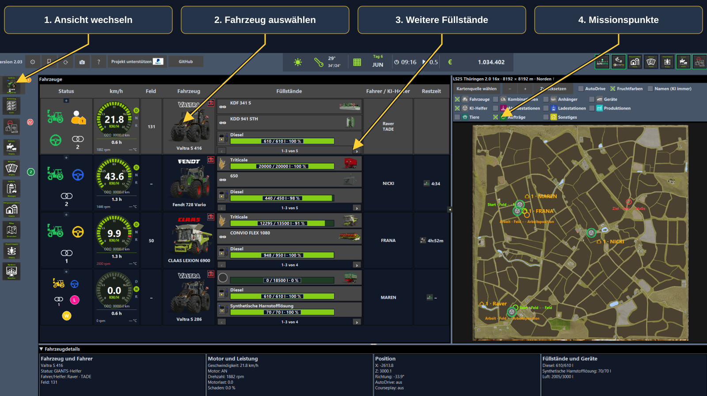
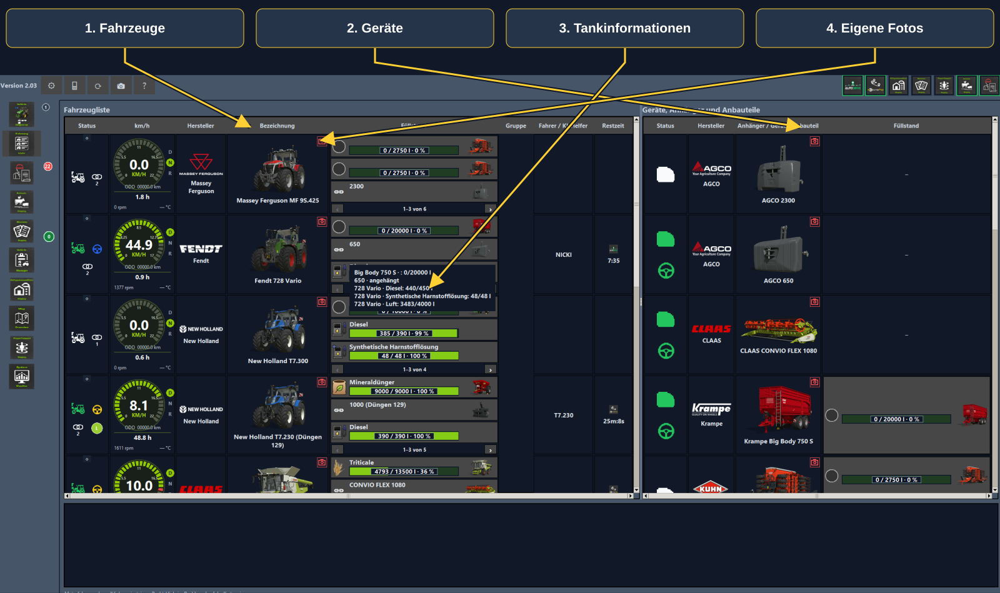
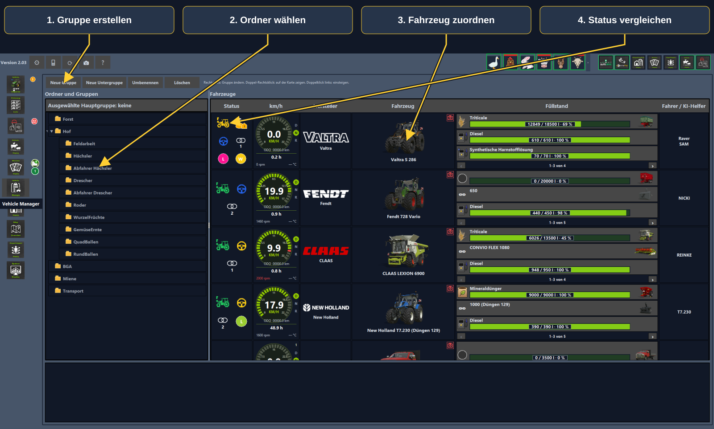
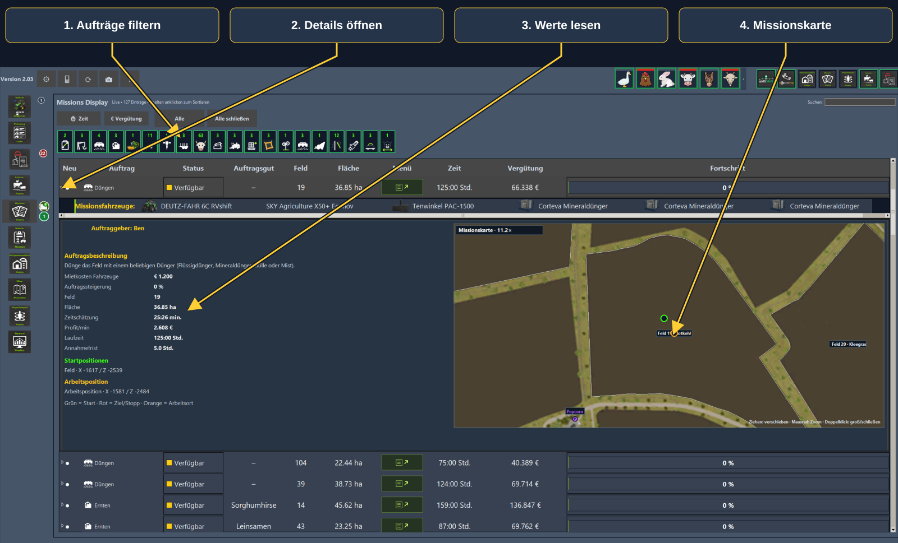
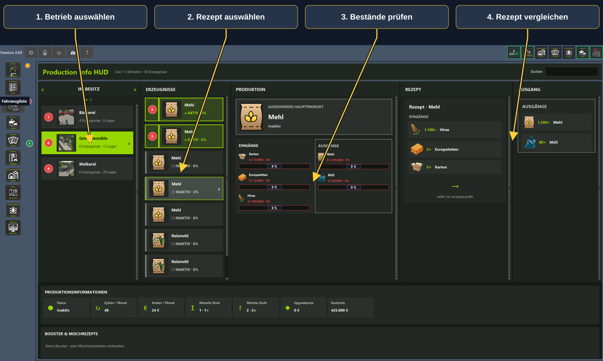
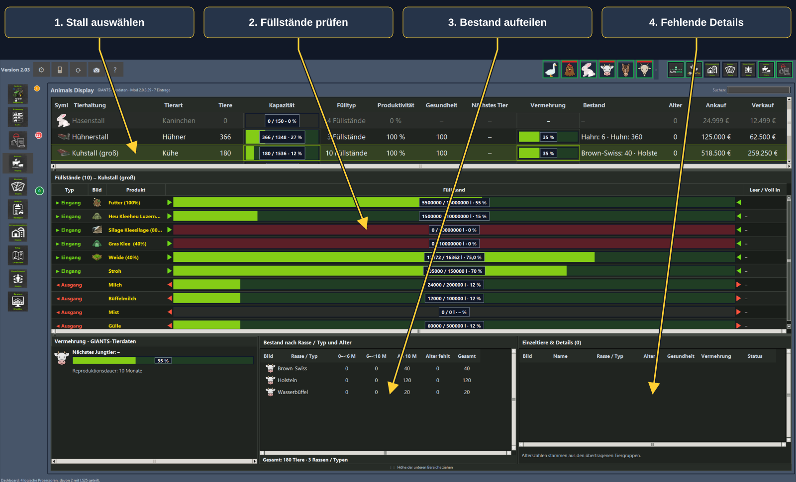
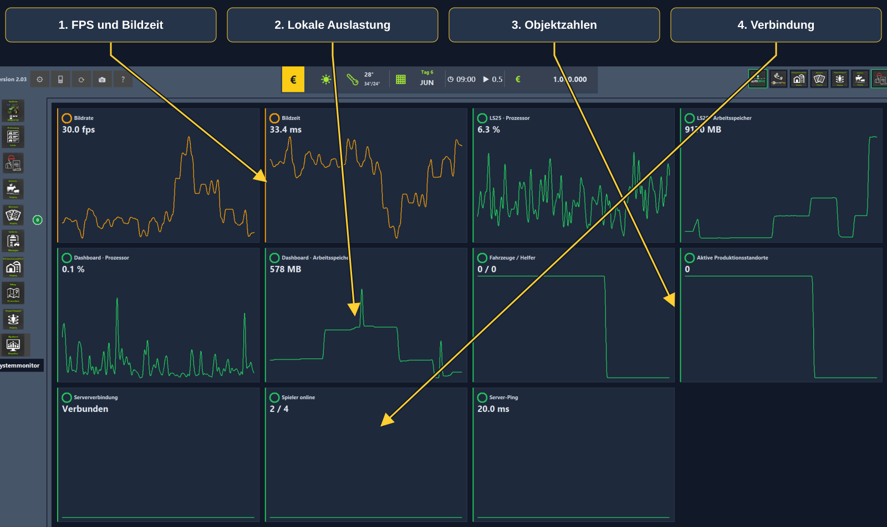

# Dashboard Schritt für Schritt

Desktop-Bilder vom 27. September 2026. Die Fahrzeugübersicht und große Karte zeigen den neueren Teststand; die übrigen Ansichten stammen aus dem Test am selben Tag. **Öffentliche Dokumentationsvorschau: Programm und Begleitmod sind noch nicht zum Download freigegeben.**

Gelbe Pfeile verbinden die Überschriften mit den Bedienelementen. Die Nummern entsprechen den Erklärungen unter jedem Bild. Klicke auf ein Bild für die große Ansicht. Die Screenshots bleiben unverändert; die Hinweise liegen auf einer separaten Vektorebene.

## Schnellstart

1. Spielstand laden, Dashboard starten und die erste Datenübernahme abwarten.
2. Links die gewünschte Ansicht wählen.
3. Ein Objekt auswählen und seine Details lesen, bevor du eine Aktion auslöst.
4. Im Multiplayer zählt der tatsächliche Hof. Fremde Hofdaten brauchen eine passende Lohnerfreigabe; Aktionen zusätzlich die jeweiligen Spielrechte.

## Fahrzeuge und Helfer

1. **Ansicht wechseln:** Links wechselst du zwischen den Ansichten. Orange zählt wartende Fahrzeuge, Rot meldet Probleme.
2. **Fahrzeug auswählen:** Ein Klick wählt das Fahrzeug und zeigt unten seine Details. Ein Doppelklick fordert das Einsteigen an, soweit die Spielrechte es erlauben.
3. **Weitere Füllstände:** Die kleinen Pfeile unter den Balken wechseln weitere Tanks und Anbaugeräte. Nutzlast und Betriebsstoffe werden getrennt angezeigt.
4. **Missionspunkte:** Aufträge blendet bekannte Start-, Arbeits- und Zielpunkte aktiver Missionen ein: Grün Start, Orange Arbeitsort, Rot Ziel.

[Original ohne Beschriftung](images/vehicle_inspector.png)

## Fahrzeugliste und Geräte

1. **Fahrzeuge:** Links stehen Motorfahrzeuge mit Marke, Modell, Status und Füllständen.
2. **Geräte:** Rechts stehen Geräte, Anhänger und Anbauteile. Bei einem Gewicht ist ein fehlender Füllstand normal.
3. **Tankinformationen:** Pfeile wechseln die sichtbaren Einträge. Beim Überfahren werden zusätzliche Tankinformationen eingeblendet.
4. **Eigene Fotos:** Die Kamera gehört zum jeweiligen Objekt. Rot bedeutet noch kein gültiges eigenes Foto, Grün ein vorhandenes Foto. Die neue Fotoanleitung am Ende erklärt den gesamten Ablauf.

[Original ohne Beschriftung](images/vehicle_list.png)

## Vehicle Manager: Gruppen

1. **Gruppe erstellen:** Neue Gruppe erstellt einen Hauptordner; Neue Untergruppe ergänzt eine Ebene unter der ausgewählten Gruppe.
2. **Ordner wählen:** Gruppen strukturieren den Fuhrpark nach Arbeit, zum Beispiel Drescher und Transport. Kleine Pfeile klappen Untergruppen auf.
3. **Fahrzeug zuordnen:** Wähle ein Fahrzeug und nutze die Gruppenzuordnung per Rechtsklick. Die Leiste oben erklärt die weiteren Mausaktionen.
4. **Status vergleichen:** Status, Geschwindigkeit, Hersteller, Füllstände und Helfer stehen nebeneinander. Stillstand bedeutet nicht automatisch eine Blockade.

[Original ohne Beschriftung](images/vehicle_manager.png)

## Missionen verstehen

1. **Aufträge filtern:** Die Symbole filtern Auftragsarten; Alle hebt die Auswahl auf. Suche und Sortierung helfen bei langen Listen.
2. **Details öffnen:** Der kleine Pfeil klappt die Mission auf. Darunter stehen die vorgesehenen Mietfahrzeuge und Geräte.
3. **Werte lesen:** Beschreibung, Mietkosten, Fläche, Schätzung und Fristen sind getrennt beschriftet. Eine Zeitschätzung ist keine garantierte Dauer.
4. **Missionskarte:** Mausrad zoomt, Ziehen verschiebt, Doppelklick vergrößert oder schließt die große Ansicht. Zielpunkte erscheinen nur, wenn die Mission sie liefert.

[Original ohne Beschriftung](images/mission_display.png)

## Produktionen versorgen

1. **Betrieb auswählen:** Klicke auf den Betrieb. Rote Zahlen weisen auf kritische Bestände hin und sind keine Produktionsmengen.
2. **Rezept auswählen:** Mehrere Rezepte dürfen denselben Produktnamen tragen. Prüfe die Zutaten, um das gewünschte Rezept auszuwählen.
3. **Bestände prüfen:** Die Mitte zeigt Ein- und Ausgänge. Aktiviert bedeutet nicht, dass ohne Zutaten tatsächlich produziert werden kann.
4. **Rezept vergleichen:** Rechts stehen Zutaten und Ergebnisse je Rezept. Unten ergänzen Status, Zyklen und Kosten die Übersicht.

[Original ohne Beschriftung](images/production_info_hud.png)

## Tiere und Versorgung

1. **Stall auswählen:** Oben wählst du die Haltung. Bestand und Kapazität beschreiben die Belegung; Gesundheit und Vermehrung sind eigene Werte.
2. **Füllstände prüfen:** Die Mitte zeigt Futter und weitere Bestände. Eingang und Ausgang sind ausdrücklich beschriftet.
3. **Bestand aufteilen:** Unten in der Mitte stehen Rassen beziehungsweise Typen nach Altersgruppen. Im Beispiel ergeben sie zusammen 180 Tiere.
4. **Fehlende Details:** Eine leere Einzeltierliste bedeutet, dass keine entsprechenden Datensätze geliefert wurden. Fehlende Werte sind nicht automatisch null.

[Original ohne Beschriftung](images/animal_display.png)

## Große Kartenübersicht

1. **Kartenfilter:** Oben schaltest du Fahrzeuge, Helfer und andere Gruppen ein. Aufträge ist in diesem Bild aus; deshalb sind hier keine Missionspunkte zu sehen.
2. **Fruchtlegende:** Links stehen die Früchte der Karte. Für ihre Darstellung muss die zugehörige Fruchtfarben-/Feldebene eingeschaltet sein.
3. **Hof und Zustand:** Namen tragen die Hoffarbe, daneben stehen Hofzeichen und Nummer. Der getrennte Ring zeigt Grün normal, Gelb Warten, Rot Problem.
4. **Karte bewegen:** Mausrad zoomt, Ziehen verschiebt. Plus, Minus und Zurücksetzen sind alternative Bedienelemente.

[Original ohne Beschriftung](images/map_overview.png)

## Systemwerte richtig lesen

1. **FPS und Bildzeit:** Diese Werte beschreiben die Darstellung auf deinem Spielrechner. Mehr FPS und kürzere Bildzeiten bedeuten normalerweise flüssigere Darstellung.
2. **Lokale Auslastung:** Spiel und Dashboard haben getrennte CPU- und Speicherwerte. Das ist keine Messung der Auslastung des gemieteten Servers.
3. **Objektzahlen:** Fahrzeug-, Helfer- und Produktionszahlen hängen von den sichtbaren Daten ab. Nach einem Hofwechsel kann null korrekt sein.
4. **Verbindung:** Verbindung, Spielerzahl und Ping ergänzen die Anzeige. Ein niedriger Ping allein schließt Serverruckler nicht aus.

[Original ohne Beschriftung](images/system_monitor.png)

## Status und Hofzugehörigkeit

- Kartenring: Grün normal, Gelb Warten, Rot Problem.
- Kartenname: Hoffarbe und Hofzeichen mit Nummer; das Original-Hofemblem ist nicht immer verfügbar.
- Zähler am Fahrzeugregister: Orange Warten, Rot Probleme, Blau AutoDrive-Parkziel, Gelb Courseplay-Arbeit beendet, Dunkelgrün GIANTS-Helfer beendet.
- Missionsstatus: Verfügbar, aktiv und abgeschlossen sind getrennte Zustände. Ein Prozentwert allein macht keinen Auftrag abgeschlossen.

## Hilfe und Projektlinks

Oben öffnet **?** die Hilfe. Rechts daneben öffnet **Projekt unterstützen** mit PayPal-Logo die freiwillige Zahlungsseite im Browser. **GitHub** führt direkt zum Dashboard-Projekt. Ein Klick löst keine Zahlung aus.

## Fahrzeugfotos und Vorschau-Icons

Die **[Fotoanleitung mit sieben bebilderten Schritten](EIGENE_SHOP_ICONS.md)** erklärt Ausrichten, Zoomen, Weiter, Final auslösen und Abbrechen. Nach Aufnahme und Abbruch bleibst du im ursprünglichen Fahrzeug. Der Nutzer hat dies im Mehrspielertest mit dem fahrenden Valtra bestätigt. Das gespeicherte Icon erscheint auch im Escape-Menü und bei installiertem Vehicle Inspector in dessen Fahrzeugvorschau.

## Browser und Tablet

Diese Bilder zeigen die Desktop-Anwendung. [Browser und Tablet](BROWSER_TABLET.md) erklärt Dropdowns, Tippen und Zwei-Finger-Zoom. Ein Test auf einem echten Tablet steht noch aus.

[Ausführliche Bedienungsanleitung](BEDIENUNG.md) · [Galerie](SCREENSHOTS.md)
